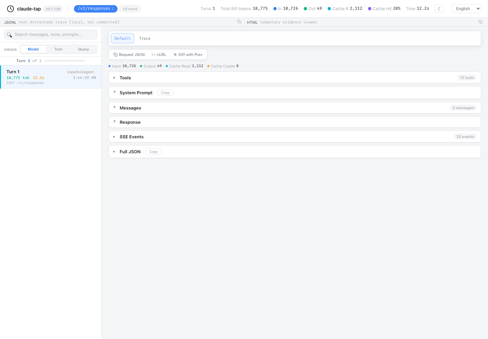

# AstronCode Trace Validation

Date: 2026-07-24

## Scope and baseline

- claude-tap baseline: `1f9b3dfa233ce613cc09bdc5ca33db0663368ee9`
- AstronCode baseline: `000d21ff72a0e3449ddd9d3f9f5602aeaed4d12d`
- AstronCode test package: isolated npm prefix built from the baseline above
- AstronCode version: `astron-code 0.0.0-master.000d21ff`
- The isolated package did not replace or mutate the user's global npm package.

## Failure-first evidence

The new regression tests were run before the implementation:

```text
uv run pytest tests/test_astron_launch.py tests/test_forward_proxy_response_sse.py tests/test_client_config_framework.py -q --timeout=10
```

- Exit code: `1`
- Result: `17 failed, 51 passed`
- Observed failures covered the missing Astron client/parser/discovery/version behavior, missing explicit executable validation, and response-driven SSE requests timing out instead of streaming.

## Automated validation

The completed implementation passed:

- targeted Astron launch, client framework, forward proxy SSE, Codex launch,
  Windows compatibility, and upstream URL regression tests:
  `98 passed, 1 skipped`;
- `uv run ruff check .`: passed;
- `uv run ruff format --check .`: `111 files already formatted`;
- `uv run pytest tests/ -x --timeout=60`: `1023 passed, 26 skipped`,
  with 31 existing warnings;
- Python total coverage: `83.51%`;
- changed Python executable-line coverage: `94.00%` (`94/100`);
- Viewer JavaScript function coverage: `78.91%`;
- Viewer CSS selector coverage: `82.54%`;
- `uv lock --check`: passed;
- `git diff --check`: passed;
- `uv run python scripts/check_legibility.py`: passed with five pre-existing
  stale-review warnings under `.agents/docs/standards/`;
- real trace viewer rendering verification: passed;
- committed screenshot quality check: passed at `1440x1000`.

## Real AstronCode E2E

Discovery and launch were exercised through three routes:

1. `astron-code` on `PATH`;
2. the current npm global prefix fallback when `astron-code` was absent from `PATH`;
3. an explicit absolute `--tap-client-cmd`.

Each route resolved the same isolated executable and reported the expected version. No route fell back to `codex`.

Three real forward-proxy runs completed with exit code `0`: an initial turn, an Apps/MCP exercise, and an exact-session resume turn. The cleaned evidence contains only categories, status classes, ordering, timing/count data, and hashes:

| Run | Records | Captured categories | Stream records/events | Sanitized digest |
|---|---:|---|---:|---|
| Initial turn | 21 | model catalog, MCP initialize/list, model response, other upstream | 1 / 25 | `8d33dd1ec2fa00607654dc0f5bead8a15b7cbe15bd45da932c581a921b259623` |
| Apps/MCP exercise | 35 | model catalog, MCP initialize/list/call, model response, other upstream | 5 / 130 | `4db1faac32b8496b98bb41b2cb4f935fdca0edd194f6ea11f5c3a0ed313ae870` |
| Exact-session resume | 19 | model catalog, MCP initialize/list, model response, other upstream | 1 / 24 | `307dea2daea97473dc02ff69b1239e1e70f4df99838335b8481329804fce576c` |

All catalog, MCP transport, and model response records had `2xx` HTTP status classes. One product bootstrap request per run returned a `4xx` status and was still captured. The Apps connector returned a timeout inside successful MCP transport responses; that is an external service result, not a proxy transport failure.

The user's AstronCode configuration had SHA-256
`311c9ef657a8bd8f0d63d14582b516d1358695c0ba91dd7f5e2637ede0b79490`
before and after validation. AstronCode temporarily added only the isolated workspace trust entry; cleanup removed that exact entry and restored the byte-identical digest.

## Screenshot evidence



The screenshot was rendered from the real initial-turn trace. Request, response, system, SSE payload, and full JSON sections were collapsed, and the task label was hidden before capture. The source trace and generated HTML remain local and are not committed.

No credentials, prompt text, response text, raw provider messages, raw tool results, endpoint hosts, or unredacted trace files are included in this evidence.
