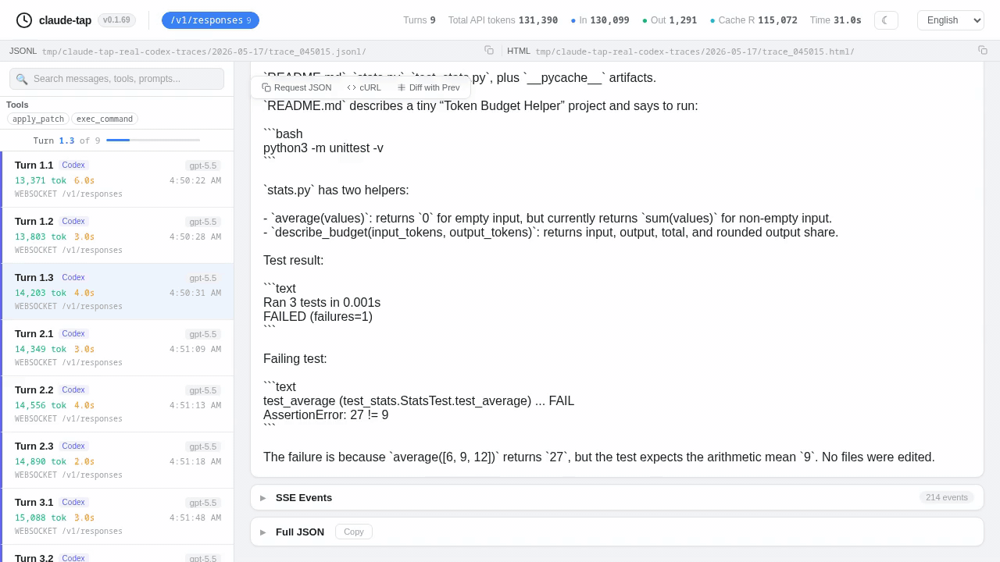
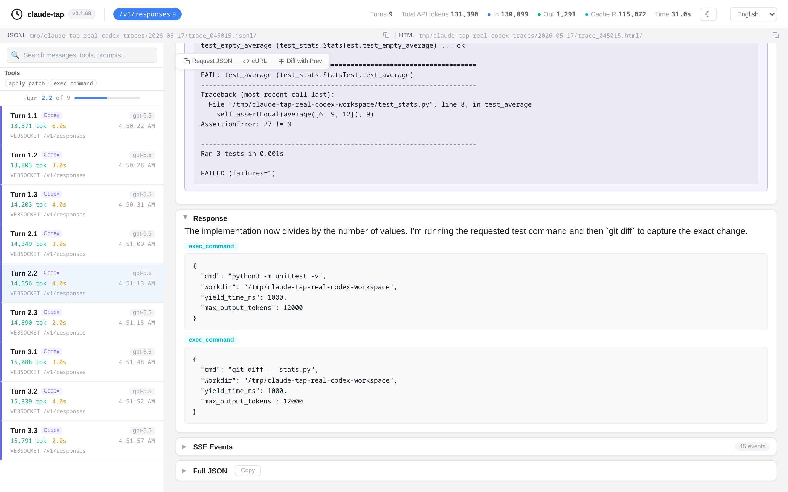
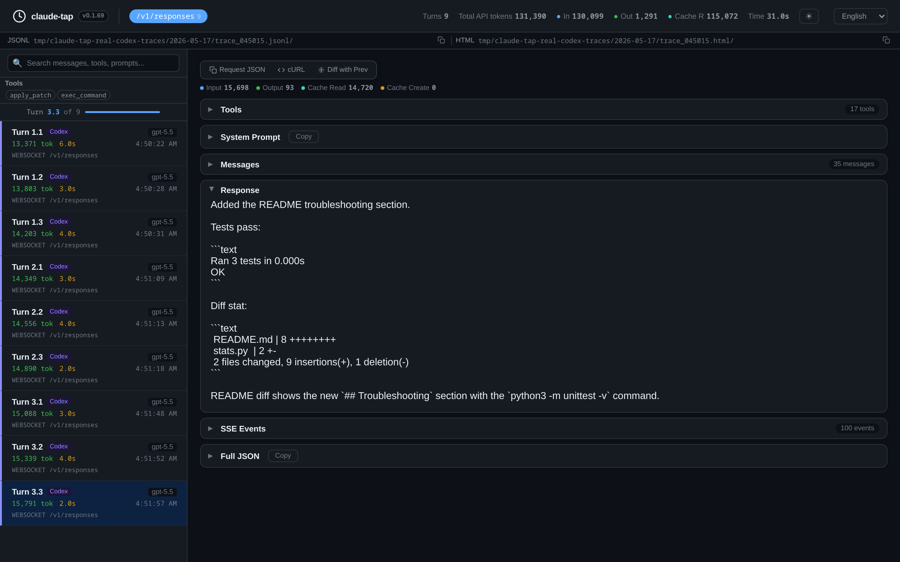
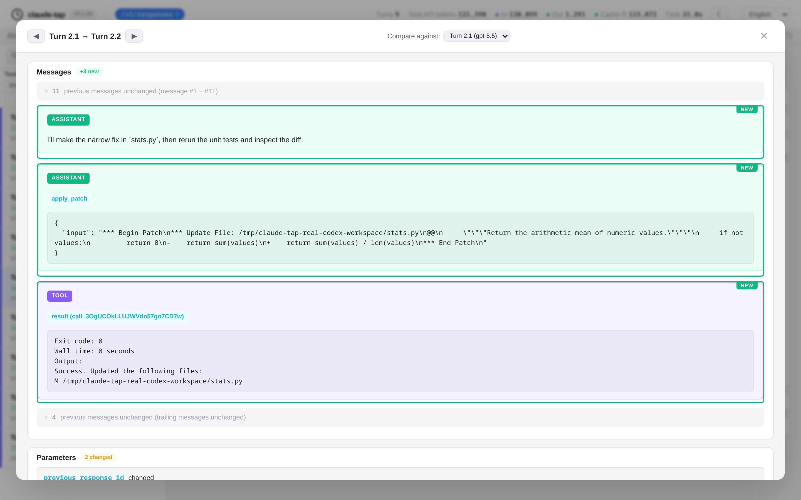
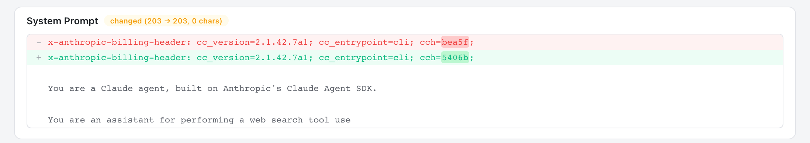
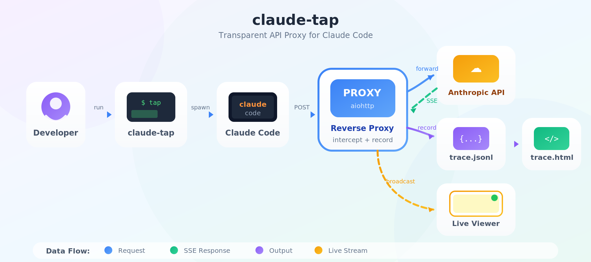

# claude-tap

[](https://pypi.org/project/claude-tap/)
[](https://pypi.org/project/claude-tap/)
[](https://pypi.org/project/claude-tap/)
[](https://github.com/liaohch3/claude-tap/blob/main/LICENSE)

[中文文档](README_zh.md)

Intercept and inspect all API traffic from [Claude Code](https://docs.anthropic.com/en/docs/claude-code), [Codex CLI](https://github.com/openai/codex), [OpenCode](https://opencode.ai), or [Hermes Agent](https://github.com/NousResearch/hermes-agent). See exactly how they construct system prompts, manage conversation history, select tools, and use tokens — in a beautiful trace viewer.





<details>
<summary>Dark Mode / Diff View</summary>





</details>

> **OpenClaw:** If you are Openclaw and integrating claude-tap with [OpenClaw](docs/guides/OPENCLAW_README.md), also read the dedicated setup guide.

## Install

Requires Python 3.11+ and the client you want to trace: [Claude Code](https://docs.anthropic.com/en/docs/claude-code) (default), [Codex CLI](https://github.com/openai/codex) for `--tap-client codex`, [OpenCode](https://opencode.ai) for `--tap-client opencode`, or [Hermes Agent](https://github.com/NousResearch/hermes-agent) for `--tap-client hermes`.

```bash
# Recommended
uv tool install claude-tap

# Or with pip
pip install claude-tap
```

Upgrade: `uv tool upgrade claude-tap` or `pip install --upgrade claude-tap`

## Usage

### Claude Code

```bash
# Basic — launch Claude Code with tracing
claude-tap

# Live mode — watch API calls in real-time in browser
claude-tap --tap-live

# Pass any flags through to Claude Code
claude-tap -- --model claude-opus-4-6
claude-tap -c    # continue last conversation

# Skip all permission prompts (auto-accept tool calls)
claude-tap -- --dangerously-skip-permissions

# Full-power combo: live viewer + skip permissions + specific model
claude-tap --tap-live -- --dangerously-skip-permissions --model claude-sonnet-4-6
```

### Codex CLI

Codex CLI supports two authentication modes with different upstream targets:

| Auth Mode | How to authenticate | Upstream target | Notes |
|-----------|-------------------|-----------------|-------|
| **OAuth** (ChatGPT subscription) | `codex login` | `https://chatgpt.com/backend-api/codex` | Default for ChatGPT Plus/Pro/Team users |
| **API Key** | Set `OPENAI_API_KEY` | `https://api.openai.com` (default) | Pay-per-use via OpenAI Platform |

`claude-tap` auto-detects the Codex target from your auth state when possible.

```bash
# OAuth users (ChatGPT Plus/Pro/Team) — auto-detected after `codex login`
claude-tap --tap-client codex

# If auto-detection cannot read your Codex auth file, specify the target explicitly
claude-tap --tap-client codex --tap-target https://chatgpt.com/backend-api/codex

# API Key users — default OpenAI API target works out of the box
claude-tap --tap-client codex

# With specific model
claude-tap --tap-client codex -- --model codex-mini-latest

# Full auto-approval (skip all permission prompts)
claude-tap --tap-client codex -- --full-auto

# OAuth + full auto + live viewer
claude-tap --tap-client codex --tap-live -- --full-auto
```

### OpenCode

[OpenCode](https://opencode.ai) is a multi-provider terminal AI assistant. Because it can talk to many providers, claude-tap defaults to **forward proxy** mode for opencode: it injects `HTTPS_PROXY` plus the local CA into the child process so traffic to any provider is captured.

```bash
# Forward proxy mode — captures every provider opencode talks to (default)
claude-tap --tap-client opencode

# With live viewer
claude-tap --tap-client opencode --tap-live

# Reverse mode — only works when using Anthropic provider (single ANTHROPIC_BASE_URL)
claude-tap --tap-client opencode --tap-proxy-mode reverse
```

### Hermes Agent

Hermes Agent is a multi-provider Python AI agent (Nous Portal, OpenRouter, NVIDIA NIM, Xiaomi MiMo, GLM, Kimi, MiniMax, Hugging Face, OpenAI, Anthropic, custom). Because it can talk to any of these providers — and `httpx` / `requests` both honor `HTTPS_PROXY` natively — claude-tap defaults to **forward proxy** mode for hermes: it injects `HTTPS_PROXY` plus the local CA into the child process so any provider is captured.

Hermes has two interaction patterns:

```bash
# A) Interactive TUI — `hermes` runs the foreground TUI; LLM calls go through the forward proxy.
#    Type messages in the TUI, watch traces in the live viewer.
claude-tap --tap-client hermes --tap-live

# B) Gateway mode — gateway must run in foreground under tap. claude-tap auto-rewrites
#    `gateway start` (which on recent hermes versions delegates to systemd / launchd)
#    to `gateway run` (foreground), so the spawned gateway is our child and inherits
#    the proxy env.
claude-tap --tap-client hermes -- gateway start
# in another terminal — connect the TUI to the foregrounded gateway
hermes

# Reverse mode is opt-in and only useful when ~/.hermes is configured with an
# OpenAI-compatible provider that reads OPENAI_BASE_URL.
claude-tap --tap-client hermes --tap-proxy-mode reverse
```

### Browser Preview

```bash
# Disable auto-open of HTML viewer after exit (on by default)
claude-tap --tap-no-open

# Live mode — real-time viewer opens in browser while client runs
claude-tap --tap-live
claude-tap --tap-live --tap-live-port 3000    # fixed port for live viewer

# Standalone dashboard — browse trace history without launching a client
claude-tap dashboard
claude-tap dashboard --tap-output-dir ./my-traces --tap-live-port 3000
```

When the client exits, you can also manually open the generated viewer:

```bash
open .traces/*/trace_*.html
```

You can also regenerate a self-contained HTML viewer from an existing JSONL trace:

```bash
claude-tap export .traces/2026-02-28/trace_141557.jsonl -o trace.html
# or:
claude-tap export .traces/2026-02-28/trace_141557.jsonl --format html
```

### Proxy-Only Mode

Start the proxy without launching a client — useful for custom setups or connecting from a separate terminal:

```bash
# Claude Code
claude-tap --tap-no-launch --tap-port 8080
# In another terminal:
ANTHROPIC_BASE_URL=http://127.0.0.1:8080 claude

# Codex CLI (OAuth)
claude-tap --tap-client codex --tap-target https://chatgpt.com/backend-api/codex --tap-no-launch --tap-port 8080
# In another terminal:
OPENAI_BASE_URL=http://127.0.0.1:8080/v1 codex -c 'openai_base_url="http://127.0.0.1:8080/v1"'

# Codex CLI (API Key)
claude-tap --tap-client codex --tap-no-launch --tap-port 8080
# In another terminal:
OPENAI_BASE_URL=http://127.0.0.1:8080/v1 codex -c 'openai_base_url="http://127.0.0.1:8080/v1"'
```

### Common Combos

```bash
# Trace Claude Code with live viewer and auto-accept
claude-tap --tap-live -- --dangerously-skip-permissions

# Trace Codex (OAuth) with live viewer and full auto
claude-tap --tap-client codex --tap-target https://chatgpt.com/backend-api/codex --tap-live -- --full-auto

# Save traces to a custom directory
claude-tap --tap-output-dir ./my-traces

# Keep only the last 10 trace sessions
claude-tap --tap-max-traces 10
```

### CLI Options

All flags are forwarded to the selected client, except these `--tap-*` ones:

```
--tap-client CLIENT      Client to launch: claude (default), codex, opencode, or hermes
--tap-target URL         Upstream API URL (default: auto per client)
--tap-live               Start real-time viewer (auto-opens browser)
--tap-live-port PORT     Port for live viewer server (default: auto)
--tap-no-open            Don't auto-open HTML viewer after exit (on by default)
--tap-output-dir DIR     Trace output directory (default: ./.traces)
--tap-port PORT          Proxy port (default: auto)
--tap-host HOST          Bind address (default: 127.0.0.1, or 0.0.0.0 in --tap-no-launch mode)
--tap-no-launch          Only start the proxy, don't launch client
--tap-max-traces N       Max trace sessions to keep (default: 50, 0 = unlimited)
--tap-no-update-check    Disable PyPI update check on startup
--tap-no-auto-update     Check for updates but don't auto-download
--tap-proxy-mode MODE    Proxy mode: reverse or forward (default: reverse for claude/codex, forward for opencode/hermes)
```

## Viewer Features

The viewer is a single self-contained HTML file (zero external dependencies):

- **Structural diff** — compare consecutive requests to see exactly what changed: new/removed messages, system prompt diffs, character-level inline highlighting
- **Path filtering** — filter by API endpoint (e.g., `/v1/messages` only)
- **Model grouping** — sidebar groups requests by model, with Claude-family priority ordering
- **Token usage breakdown** — input / output / cache read / cache creation
- **Tool inspector** — expandable cards with tool name, description, and parameter schema
- **Search** — full-text search across messages, tools, prompts, and responses
- **Dark mode** — toggle light/dark themes (respects system preference)
- **Keyboard navigation** — `j`/`k` or arrow keys
- **Copy helpers** — one-click copy of request JSON or cURL command
- **i18n** — English, 简体中文, 日本語, 한국어, Français, العربية, Deutsch, Русский

## Architecture



**How it works:**

1. `claude-tap` starts a reverse proxy and spawns the selected client (`claude` or `codex`) with the provider-specific base URL pointing to it
2. Supported API requests flow through the proxy → upstream API → back through proxy
3. SSE and WebSocket streams are forwarded as chunks/messages arrive with low proxy overhead
4. Each request-response pair or WebSocket session is recorded to a dated `trace_*.jsonl`
5. On exit, a self-contained HTML viewer is generated
6. Live mode (optional) broadcasts updates to browser via SSE

**Key features:** 🔒 Common auth headers auto-redacted · ⚡ Low-overhead streaming · 📦 Self-contained viewer · 🔄 Real-time live mode

## Community

[](https://www.star-history.com/#liaohch3/claude-tap&Date)

<a href="https://github.com/liaohch3/claude-tap/graphs/contributors">
  
</a>

## Contributing

Contributions are welcome. Start with [CONTRIBUTING.md](CONTRIBUTING.md).

## License

MIT
