# claude-tap

[](https://pypi.org/project/claude-tap/)
[](https://pypi.org/project/claude-tap/)
[](https://pypi.org/project/claude-tap/)
[](https://github.com/liaohch3/claude-tap/blob/main/LICENSE)

[中文文档](README_zh.md)

Intercept and inspect all API traffic from [Claude Code](https://docs.anthropic.com/en/docs/claude-code). See exactly how it constructs system prompts, manages conversation history, selects tools, and uses tokens — in a beautiful trace viewer.


<details>
<summary>Dark Mode / Diff View</summary>


</details>

## Install

Requires Python 3.11+ and [Claude Code](https://docs.anthropic.com/en/docs/claude-code).

```bash
# Recommended
uv tool install claude-tap

# Or with pip
pip install claude-tap
```

Upgrade: `uv tool upgrade claude-tap` or `pip install --upgrade claude-tap`

## Usage

```bash
# Basic — launch Claude Code with tracing
claude-tap

# Live mode — watch API calls in real-time in browser
claude-tap --tap-live

# Pass any flags through to Claude Code
claude-tap -- --model claude-opus-4-6
claude-tap -c    # continue last conversation
```

When Claude Code exits, open the generated HTML viewer:

```bash
open .traces/trace_*.html
```

### CLI Options

All flags are forwarded to Claude Code, except these `--tap-*` ones:

```
--tap-live             Start real-time viewer (auto-opens browser)
--tap-live-port PORT   Port for live viewer server (default: auto)
--tap-open             Open HTML viewer in browser after exit
--tap-output-dir DIR   Trace output directory (default: ./.traces)
--tap-port PORT        Proxy port (default: auto)
--tap-target URL       Upstream API URL (default: https://api.anthropic.com)
--tap-no-launch        Only start the proxy, don't launch Claude Code
```

**Proxy-only mode** (useful for custom setups):

```bash
claude-tap --tap-no-launch --tap-port 8080
# In another terminal:
ANTHROPIC_BASE_URL=http://127.0.0.1:8080 claude
```

## Viewer Features

The viewer is a single self-contained HTML file (zero external dependencies):

- **Structural diff** — compare consecutive requests to see exactly what changed: new/removed messages, system prompt diffs, character-level inline highlighting
- **Path filtering** — filter by API endpoint (e.g., `/v1/messages` only)
- **Model grouping** — sidebar groups requests by model (Opus > Sonnet > Haiku)
- **Token usage breakdown** — input / output / cache read / cache creation
- **Tool inspector** — expandable cards with tool name, description, and parameter schema
- **Search** — full-text search across messages, tools, prompts, and responses
- **Dark mode** — toggle light/dark themes (respects system preference)
- **Keyboard navigation** — `j`/`k` or arrow keys
- **Copy helpers** — one-click copy of request JSON or cURL command
- **i18n** — English, 简体中文, 日本語, 한국어, Français, العربية, Deutsch, Русский

## Architecture

```mermaid
flowchart TB
    subgraph Terminal["🖥️ Terminal"]
        CT["claude-tap"]
        CC["Claude Code"]
    end

    subgraph Proxy["🔀 Reverse Proxy (aiohttp)"]
        PH["Proxy Handler"]
        SSE["SSE Reassembler"]
    end

    subgraph Storage["💾 Storage"]
        TW["Trace Writer"]
        JSONL[("trace.jsonl")]
        HTML["trace.html"]
    end

    subgraph Live["🌐 Live Mode (optional)"]
        LVS["Live Viewer Server"]
        Browser["Browser (SSE)"]
    end

    API["☁️ api.anthropic.com"]

    CT -->|"1. Starts"| PH
    CT -->|"2. Spawns with<br/>ANTHROPIC_BASE_URL"| CC
    CC -->|"3. API Request"| PH
    PH -->|"4. Forward"| API
    API -->|"5. SSE Stream"| PH
    PH --> SSE
    SSE -->|"6. Reconstruct<br/>Response"| TW
    TW -->|"7. Write"| JSONL
    JSONL -->|"8. On Exit:<br/>Generate"| HTML

    TW -.->|"Broadcast"| LVS
    LVS -.->|"Push Updates"| Browser

    style CT fill:#d4a5ff,stroke:#8b5cf6,color:#1a1a2e
    style CC fill:#a5d4ff,stroke:#3b82f6,color:#1a1a2e
    style API fill:#ffa5a5,stroke:#ef4444,color:#1a1a2e
    style JSONL fill:#a5ffd4,stroke:#10b981,color:#1a1a2e
    style HTML fill:#ffd4a5,stroke:#f59e0b,color:#1a1a2e
    style Browser fill:#a5ffd4,stroke:#10b981,color:#1a1a2e
```



**Key Points:**

- 🔒 API keys are automatically redacted in traces
- ⚡ Zero added latency — SSE streams are forwarded in real-time
- 📦 Self-contained HTML viewer with no external dependencies
- 🔄 Live mode enables real-time inspection via Server-Sent Events

## License

MIT
