# claude-tap

[](https://pypi.org/project/claude-tap/)
[](https://pypi.org/project/claude-tap/)
[](https://pypi.org/project/claude-tap/)
[](https://github.com/liaohch3/claude-tap/blob/main/LICENSE)

[English](README.md)

拦截并查看 [Claude Code](https://docs.anthropic.com/en/docs/claude-code) 的所有 API 流量。看清它如何构造 system prompt、管理对话历史、选择工具、优化 token 用量——通过一个美观的 trace 查看器。


<details>
<summary>暗色模式 / Diff 视图</summary>


</details>

## 安装

需要 Python 3.11+ 和 [Claude Code](https://docs.anthropic.com/en/docs/claude-code)。

```bash
# 推荐
uv tool install claude-tap

# 或用 pip
pip install claude-tap
```

升级: `uv tool upgrade claude-tap` 或 `pip install --upgrade claude-tap`

## 使用

```bash
# 基本用法 — 启动带 trace 的 Claude Code
claude-tap

# 实时模式 — 在浏览器中实时观察 API 调用
claude-tap --tap-live

# 透传参数给 Claude Code
claude-tap -- --model claude-opus-4-6
claude-tap -c    # 继续上次对话
```

Claude Code 退出后，打开生成的 HTML 查看器：

```bash
open .traces/trace_*.html
```

### CLI 选项

除以下 `--tap-*` 参数外，所有参数均透传给 Claude Code：

```
--tap-live             启动实时查看器（自动打开浏览器）
--tap-live-port PORT   实时查看器端口（默认: 自动分配）
--tap-open             退出后自动在浏览器中打开 HTML 查看器
--tap-output-dir DIR   Trace 输出目录（默认: ./.traces）
--tap-port PORT        代理端口（默认: 自动分配）
--tap-target URL       上游 API 地址（默认: https://api.anthropic.com）
--tap-no-launch        仅启动代理，不启动 Claude Code
```

**纯代理模式**（适用于自定义场景）：

```bash
claude-tap --tap-no-launch --tap-port 8080
# 在另一个终端:
ANTHROPIC_BASE_URL=http://127.0.0.1:8080 claude
```

## 查看器功能

查看器是一个自包含的 HTML 文件（零外部依赖）：

- **结构化 Diff** — 对比相邻请求的变化：新增/删除的消息、system prompt diff、字符级高亮
- **路径过滤** — 按 API 端点筛选（如仅显示 `/v1/messages`）
- **模型分组** — 侧边栏按模型分组（Opus > Sonnet > Haiku）
- **Token 用量分析** — 输入 / 输出 / 缓存读取 / 缓存创建
- **工具检查器** — 可展开的卡片，显示工具名称、描述和参数 schema
- **全文搜索** — 搜索消息、工具、prompt 和响应
- **暗色模式** — 切换亮色/暗色主题（跟随系统偏好）
- **键盘导航** — `j`/`k` 或方向键
- **复制助手** — 一键复制请求 JSON 或 cURL 命令
- **多语言** — English, 简体中文, 日本語, 한국어, Français, العربية, Deutsch, Русский

## 架构

```mermaid
flowchart TB
    subgraph Terminal["🖥️ 终端"]
        CT["claude-tap"]
        CC["Claude Code"]
    end

    subgraph Proxy["🔀 反向代理 (aiohttp)"]
        PH["代理处理器"]
        SSE["SSE 重组器"]
    end

    subgraph Storage["💾 存储"]
        TW["Trace 写入器"]
        JSONL[("trace.jsonl")]
        HTML["trace.html"]
    end

    subgraph Live["🌐 实时模式 (可选)"]
        LVS["实时查看器服务"]
        Browser["浏览器 (SSE)"]
    end

    API["☁️ api.anthropic.com"]

    CT -->|"1. 启动"| PH
    CT -->|"2. 带 ANTHROPIC_BASE_URL<br/>启动"| CC
    CC -->|"3. API 请求"| PH
    PH -->|"4. 转发"| API
    API -->|"5. SSE 流"| PH
    PH --> SSE
    SSE -->|"6. 重组<br/>响应"| TW
    TW -->|"7. 写入"| JSONL
    JSONL -->|"8. 退出时:<br/>生成"| HTML

    TW -.->|"广播"| LVS
    LVS -.->|"推送更新"| Browser

    style CT fill:#d4a5ff,stroke:#8b5cf6,color:#1a1a2e
    style CC fill:#a5d4ff,stroke:#3b82f6,color:#1a1a2e
    style API fill:#ffa5a5,stroke:#ef4444,color:#1a1a2e
    style JSONL fill:#a5ffd4,stroke:#10b981,color:#1a1a2e
    style HTML fill:#ffd4a5,stroke:#f59e0b,color:#1a1a2e
    style Browser fill:#a5ffd4,stroke:#10b981,color:#1a1a2e
```



**要点:**

- 🔒 API key 在 trace 中自动脱敏
- ⚡ 零额外延迟 — SSE 流实时转发
- 📦 自包含 HTML 查看器，无外部依赖
- 🔄 实时模式通过 Server-Sent Events 实现即时检查

## 许可证

MIT
