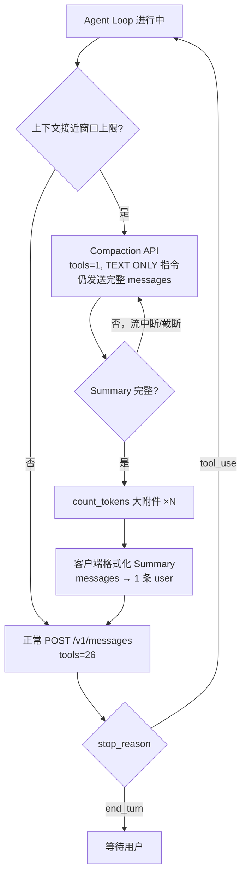

# Claude Code 工作机制（三）：上下文压缩（Context Compaction）

> 本文基于一条真实的 API trace（288 次请求，跨 3 天的同一会话）拆解 Claude Code 的 Context Compaction 行为。
> 数据来源：[claude-tap](https://github.com/liaohch3/claude-tap) 抓取的 `trace_153613.jsonl`（撰写本 wiki 系列时在 claude-tap 仓库内的长会话；与 `trace_231138.jsonl` 不同——需要更长的会话才能触发压缩）。WyckoffAgent 开发相关 trace 见 [（五）](./claude-code-context-5.md) 等篇。
>
> **系列目录**：
> - [（一）请求结构全解](./claude-code-context.md)
> - [（二）Agent Loop 与运行时机制](./claude-code-context-2.md)
> - **（三）上下文压缩** ← 本文
> - [（四）Skills 技能系统](./claude-code-context-4.md)
> - [（五）Memory 记忆系统](./claude-code-context-5.md)
> - [（六）Task 任务与后台通知](./claude-code-context-6.md)
> - [（七）Plan Mode 与用户确认](./claude-code-context-7.md)
> - [（八）MCP 集成](./claude-code-context-8.md)
> - [（九）Agent 子代理](./claude-code-context-9.md)

---

## 1. 压缩触发点：Turn 117–118 → 122

Claude Code 通过 `context-management-2025-06-27` beta feature 实现自动压缩。当上下文接近窗口上限时，客户端先发起**专用的 Summary 生成请求**（仍携带完整 211 条 messages），成功后再把 history **替换**为一条带结构化 Summary 的 user message，Agent Loop 随后继续运行。

**触发时机**：客户端在每轮主循环结束后检测累计 input tokens，达到阈值即启动压缩。两次压缩的精确数据：

| | 第一次压缩 | 第二次压缩 |
|--|-----------|-----------|
| 触发前最后正常轮 | Turn 116 | Turn 214 |
| `cache_read` | 159,423 | 0 |
| `cache_creation` | 2,498 | 26,229 |
| `input_tokens` | 1 | 130,424 |
| **total input** | **161,922** | **156,653** |
| 窗口占比（/200K） | **81.0%** | **78.3%** |
| Compaction 专用调用 | Turn 117（截断）+ 118（成功） | Turn 215（一次成功） |

两次触发点落在 **78–81%** 窗口容量区间。精确阈值未在 trace 字段中暴露（无 `trigger_threshold` 类信号），但数据一致指向 **~80%** 附近的硬编码或动态阈值。

**Turn 117 截断 vs 118 成功的 diff**：两次请求 **完全相同**（211 messages、1 tool、5,978 chars 指令文本、相同 system blocks）。Turn 117 的 `stop_reason=None` + `usage={}` 表明 SSE 流在服务端中断（非客户端主动取消），Turn 118 是**自动重试**而非修改后重发。

> **纠正**：Turn 117、118 **不是**「压缩前的最后一轮 agent loop」，而是两次 **compaction 专用 API 调用**（见 §1.1）。Turn 116（209 messages，`tool_use`）才是压缩前最后一轮正常主循环。

### 终端 TUI：压缩进行中

用户在终端里能直接看到压缩过程——Agent Loop 暂停，底部出现进度条：


```
* Compacting conversation... (11s · ↓ 178 tokens)
[████████░░░░░░░░░░░░░░░░░░░░░░] 12%
```

含义：
- **`Compacting conversation...`**：客户端正在调用模型生成 Summary，替换旧 messages
- **`↓ 178 tokens`**：当前压缩轮次的 token 变化（实时更新）
- **进度条**：压缩子流程的 UI 反馈，完成后 Agent Loop 恢复

这是**用户侧**可观测的压缩信号；下面的 trace / dashboard 证据来自同一次会话的 API 层。

### 1.1 Compaction 专用 API 调用（Turn 117–118）

Summary 生成阶段与正常 agent loop **形态不同**：


| 特征 | 正常 loop（Turn 116） | Compaction（Turn 117–118） |
|------|----------------------|---------------------------|
| tools | **26** | **1**（仅 Read） |
| 最后 user 块 | 普通对话 / tool_result | **`CRITICAL: Respond with TEXT ONLY...`** |
| 期望输出 | text + tool_use | `<analysis>` + `<summary>` 纯文本 |
| Prompt Cache | 大量 cache_read | **0**（142,818 tokens 全价 input） |
| max_tokens | 常规 | **20,000** |
| model | opus-4.6 | opus-4.6 |

> 注意 System Prompt 变为 `"You are a helpful AI assistant tasked with summarizing conversations."`——不再是主循环的完整 system prompt。

Compaction 指令核心片段（Turn 118 原文）：

```text
CRITICAL: Respond with TEXT ONLY. Do NOT call any tools.
- Tool calls will be REJECTED and will waste your only turn — you will fail the task.
- Your entire response must be plain text: an <analysis> block followed by a <summary> block.
...
This summary should be thorough in capturing technical details, code patterns, and architectural decisions...
```

**双轮 Summary 生成**（同一会话仅观察到这一次 retry）：

| Turn | 耗时 | input | output | stop_reason | 结果 |
|------|------|-------|--------|-------------|------|
| **117** | 83s | （usage 为空） | ~11,335 chars | **None** | Summary **截断**于 §8 中途，无 `</summary>`；SSE 流在 `content_block_delta` 处戛然而止，无 `message_stop` |
| **118** | 85s | 142,818 | 3,745 tokens | **end_turn** | 完整 `<analysis>+<summary>`（~12,149 chars） |

Turn 117 的截断响应（写到 "8. Current Work" 中途戛然而止）：


Turn 118 成功生成的完整 `<analysis>` + `<summary>`：


Turn 118 在 Turn 117 结束后**立即**发起（间隔 <1s），同一 211 条 messages、同一 compaction 指令——推断为 **Turn 117 流异常中断后的自动重试**，而非刻意两轮生成。

Compaction 调用 **不走 Prompt Cache**（`cache_read=0`），142k input 按全价计费——压缩本身成本不低。

### trace 侧：messages 数量突变

| Turn | 时间 (UTC) | messages 数 | 说明 |
|------|------------|-------------|------|
| 116 | 11:36:37 | **209** | 压缩前最后一轮**正常** agent loop |
| **117** | 11:38:01 | **211** | **Compaction 专用** Summary 生成（第 1 次，流中断） |
| **118** | 11:39:26 | **211** | **Compaction 专用** Summary 生成（第 2 次，成功） |
| 119 | 11:39:26 | 1 | `count_tokens` → Part 1 文章 **9,642 tokens** |
| 120 | 11:39:26 | 1 | `count_tokens` → Part 2 文章 **8,460 tokens** |
| 121 | 11:39:26 | 1 | `count_tokens` → Python 源码 **4,182 tokens** |
| **122** | **11:39:32** | **1** | **压缩后首次主循环**（Summary 已注入 block 9） |
| 123 | 11:39:55 | 3 | 压缩后继续 agent loop |
| 124 | 11:40:00 | 5 | 正常 +2 增长 |

**6 秒内**（Turn 118 完成 → count_tokens ×3 → Turn 122）：211 条 → 1 条。这是 compaction **落地**最核心的可观测特征；Summary **生成**则发生在 Turn 117–118（合计 ~168s API 时间）。

### Dashboard：Summary 续接块

Turn 122 的 user message 首段（claude-tap dashboard）：


标准续接句（搜索 `this session is` 即可在 trace 中定位）：

> **This session is being continued from a previous conversation that ran out of context.** The summary below covers the earlier portion of the conversation.

---

## 2. 压缩后的 messages 结构

Turn 122 只有 **1 条 user message**，`content` 为 **10 个 text block**（block 0–9，按顺序）：

| Block | 类型 | 作用 |
|-------|------|------|
| 0 | `<system-reminder>` | 提示 `claude-code-context.md` 在压缩前被 Read 过，内容太大无法内联 |
| 1 | `<system-reminder>` | 提示 `claude-code-context-2.md` 同上 |
| 2 | `<system-reminder>` | Read tool 调用元数据：CLAUDE.md |
| 3 | `<system-reminder>` | Read tool 结果：CLAUDE.md 完整内容（540 chars） |
| 4 | `<system-reminder>` | Read tool 调用元数据：tool_pool.py |
| 5 | `<system-reminder>` | Read tool 结果：tool_pool.py 完整内容（1,217 chars） |
| 6 | `<system-reminder>` | Read tool 调用元数据：runtime.py |
| 7 | `<system-reminder>` | Read tool 结果：runtime.py 完整内容（8,966 chars） |
| 8 | `<system-reminder>` | `# claudeMd` 项目 CLAUDE.md + `# currentDate`（1,061 chars；格式见 [（一）§4.4.1](./claude-code-context.md#441-claudemd-指令claudemd)） |
| **9** | **Summary 正文** | **7,980 字符的结构化摘要**（无 system-reminder 包裹） |

> Block 2–7 的模式：compaction 保留了压缩前**最后几次 Read 的调用入参和完整结果**，以 system-reminder 形式"回放"，确保模型仍能引用这些文件内容。Block 0–1 则是**体积过大无法内联**的文件，只留提示让模型按需重新 Read。

### Summary 块结构


Summary 以固定模板组织（英文），本次 trace 包含 **9 个章节**（由 compaction 指令明确指定）：

```
Summary:
1. Primary Request and Intent
2. Key Technical Concepts
3. Files and Code Sections
4. Errors and fixes
5. Problem Solving
6. All user messages
7. Pending Tasks
8. Current Work
9. Optional Next Step
```

摘要开头片段（Turn 122 原文）：

```text
This session is being continued from a previous conversation that ran out of context.
The summary below covers the earlier portion of the conversation.

Summary:
1. Primary Request and Intent:
   The user wants to write a high-quality article about Claude Code's working mechanism,
   split into two parts for GitHub wiki pages...
```

压缩**不是**简单截断尾部，而是把 211 条对话**替换**为一条「续接 + 结构化 Summary」的 user message；压缩前的 tool_result / assistant 回复不再逐条出现在 messages 里。

**客户端后处理**：Turn 118 API 返回的是 `<analysis>…</analysis><summary>…</summary>` XML（总 12,149 chars，其中 `<summary>` 体 7,303 chars）；Turn 122 block 9 则变为带续接句的纯文本 `Summary:` 标题（7,980 chars）——客户端剥离了 XML 标签、添加了续接句、可能做了轻微格式化改写，而非原样粘贴 API 响应。

### 压缩后的 system-reminder 模式

压缩后，此前 Read 过的文件会收到提醒（Turn 122 block 0）：

```text
<system-reminder>
Note: /Users/youngcan/claude-tap/docs/guides/claude-code-context.md was read before
the last conversation was summarized, but the contents are too large to include.
Use Read tool if you need to access it.
</system-reminder>
```

含义：模型「知道」读过这些文件，但完整内容不在 context 里；需要时应重新 Read。

---

## 3. 压缩前后的辅助 API 调用

Turn 118（Summary 成功）与 Turn 122（messages 落地）之间，有 3 次 **`POST /v1/messages/count_tokens?beta=true`**（Turn 119–121）：


| Turn | 路径 | tools | 计 token 对象 | 返回 input_tokens |
|------|------|-------|---------------|-------------------|
| 119 | `/v1/messages/count_tokens` | 0 | Part 1 文章全文 | **9,642** |
| 120 | `/v1/messages/count_tokens` | 0 | Part 2 文章全文 | **8,460** |
| 121 | `/v1/messages/count_tokens` | 0 | Python 源码片段 | **4,182** |

特征：`tools=[]`、无 `max_tokens`、不产生 agent 回复；beta header 含 `token-counting-2024-11-01`。三次请求**并发发出**（时间戳相差 <70ms），时序在 Summary **生成之后**、messages **替换之前**——推断为客户端在组装新 context 前**估算大附件体积**，决定哪些文件内容可以完整内联到 system-reminder（block 3/5/7），哪些只留一句"内容太大，请重新 Read"（block 0/1）。

> 验证：Part 1 = 9,642 tokens、Part 2 = 8,460 tokens 均被判为"太大无法内联"（block 0–1 只留提示）；CLAUDE.md（540 chars）、tool_pool.py（1,217 chars）、runtime.py（8,966 chars）则被完整保留在 block 3/5/7 中。截断阈值未在 trace 中暴露，但从结果看大约在 **~5,000 tokens 以上** 就只留提示。

Turn 122 的 usage 也印证「冷启动式」前缀重建：

```json
{
  "input_tokens": 6800,
  "cache_read_input_tokens": 20068,
  "cache_creation_input_tokens": 6114,
  "output_tokens": 161,
  "stop_reason": "tool_use"
}
```

压缩后 messages 极短，但 system + tools 仍走 cache；Summary 与新前缀写入 `cache_creation`。

---

## 4. 如何与「非压缩」现象区分

同一条 trace 里也有 **messages 骤降但并非 compaction** 的情况：

### Turn 3 / 33（153613）：Sonnet 网页抓取

> 下文 turn 编号来自 `trace_153613`（写文章会话）。`trace_231138` 较短，**仅有 Turn 1 Sonnet 预检**，无此类抓取。

- `model=aws.claude-sonnet-4.6`，`tools=[]`
- 唯一 message 为 `Web page content: ... GitHub Wiki`（Turn 3 抓 wiki 旧稿，Turn 33 抓 Architecture 页）
- 下一 turn Opus 主 loop 的 messages **从原长度继续**，不保持「1 条」

这是 **WebFetch 前置类单次 Sonnet 请求**，不是上下文压缩。调度细节见 [（二）§4 多模型调度](./claude-code-context-2.md#4-完整生命周期一览)。

### compaction 特征清单

| 特征 | 真压缩（Turn 122） | 非压缩骤降（Sonnet WebFetch，153613 T3） |
|------|-------------------|----------------------------------------|
| messages 变化 | 211 → 1，后续从 3 条重建 | 单次请求 msgs=1，**主 loop 下一 turn 恢复原长度** |
| `ran out of context` 续接句 | ✅ | ❌ |
| 结构化 `Summary:` 块 | ✅（~8KB） | ❌ |
| `was summarized` system-reminder | ✅ | ❌ |

---

## 5. 与 Agent Loop 的关系

压缩不改变 [（二）](./claude-code-context-2.md) 中的 stop_reason 循环模型，而是在 loop **内部**替换 `messages` 数组：



伪代码（推断，与 trace 时序一致）：

```typescript
if (shouldCompact(messages)) {
  let summary = await generateSummary(messages, { tools: [Read], textOnly: true });
  if (!summary.complete) summary = await generateSummary(messages, ...);  // Turn 117→118
  await countTokens(largeAttachments);  // Part1/Part2/源码
  messages = injectCompactedContext(summary);  // → 1 条 user + system-reminders + Summary
}
```

Beta feature：`context-management-2025-06-27`（每条主循环请求的 `anthropic-beta` header 均包含）。

---

## 6. 同会话第二次压缩（Turn 215 → 219）

本 trace **共 2 次** compaction，第二次发生在第一次落地后约 **38 小时**（Turn 122 = 05-25 11:39 UTC → Turn 219 = 05-27 01:42 UTC），模式高度一致：


| 阶段 | Turn | messages | 说明 |
|------|------|----------|------|
| 压缩前末轮 loop | 214 | 171 | 正常 agent loop（`end_turn`） |
| Summary 生成 | **215** | 171 | Compaction API，`tools=1`，`input=134,874`，81s，`end_turn` |
| count_tokens | 216–218 | 1 | 并发：Part 1 = 11,481 / Part 2 = 8,014 / 源码 = 4,182 tokens |
| 落地 | **219** | **1** | 压缩后首次主循环（block 9 = 8,014 chars） |

### 对比两次压缩

| 指标 | 第一次（Turn 122） | 第二次（Turn 219） |
|------|-------------------|-------------------|
| 压缩前 messages | 211 | 171 |
| Summary 生成次数 | 2（117 失败 + 118 成功） | 1（215 一次成功） |
| Summary 长度（block 9） | 7,980 chars | 8,014 chars |
| Summary 章节数 | 9 | 9 |
| Compaction input tokens | 142,818 | 134,874 |
| 压缩后 block 结构 | 10 blocks（0–9） | 10 blocks（0–9） |
| 压缩后 block 0–7 内容 | 完全相同 | 完全相同 |

**嵌套压缩行为**：第二次 Summary 并非"总结上次 Summary + 后续对话"的嵌套结构。从 block 0–7 看，两次压缩后保留的 system-reminder 元数据**完全一致**（同样的 Read 回放）；block 9 的 Summary 则是对**整段对话（含上次 Summary 之后的新内容）**重新生成，结构和第一次相同，长度略增（+34 chars）。

> 这意味着 compaction 是**全量重写**而非增量追加——第二次压缩时仍然发送 171 条完整 messages（包含第一次的 Summary 作为历史），模型从头生成新的摘要。

Compaction 专用 API turn 全 trace 仅 **3 次**：117（流中断）、118（成功）、215（成功）。

---

## 7. 数据速查表

基于本次 trace 的统计（截至 Turn 289，会话仍在增长）：

| 指标 | 数值 |
|------|------|
| API 调用总次数 | 288 |
| 其中 `/v1/messages` | 280 |
| 其中 `count_tokens` | 8（6 次为 compaction 附属，2 次为其他用途） |
| Compaction 次数 | **2**（Turn 122、Turn 219 落地） |
| Summary 生成 API | **3**（117 流中断 + 118 成功 + 215 成功） |
| 首次压缩前 messages | **211**（生成时）/ **209**（末轮正常 loop） |
| 第二次压缩前 messages | **171** |
| 压缩后 messages | **1**（两次均为 1） |
| Summary 长度（block 9） | 7,980 / 8,014 字符（两次） |
| Compaction input（无 cache） | 142,818 / 134,874 tokens |
| 压缩后首轮 input | 6,800 + 20,068 cache_read + 6,114 cache_create |
| 两次压缩间隔 | ~38 小时（同一 session） |

> **TUI vs API 耗时**：终端显示 `Compacting conversation... (11s · ↓178 tokens)`，而 Turn 117+118 API 合计 ~168s。TUI 的 11s / ↓178 tokens 更可能跟踪**客户端侧某阶段**（如 token 估算或后处理），不等于完整 Summary 生成的 API 等待时间。

---

## 8. System Prompt 中的上下文管理与 Git 状态快照

在每次 API 请求的 System Prompt 中，都包含一个特定的 `# Context management` 章节。根据本地 SQLite 数据库中捕获的真实系统指令，该章节具有双重作用：

### 8.1 告知模型自动压缩规则
首先，该段预先告知模型它的对话可能会在后台被自动压缩，安抚模型并引导其不要因为消息历史变短而焦虑或主动“收尾”：
> "When the conversation grows long, some or all of the current context is summarized; the summary, along with any remaining unsummarized context, is provided in the next context window so work can continue — you don't need to wrap up early or hand off mid-task."

### 8.2 注入初始化 Git 状态快照（gitStatus）
这是非常关键的工程细节：**系统在初始化或会话压缩重建时，会把启动时的 Git 状态与历史提交记录作为一个静态快照注入在 `# Context management` 章节下**，具体格式如下：
```text
gitStatus: This is the git status at the start of the conversation. Note that this status is a snapshot in time, and will not update during the conversation.

Current branch: codex/sqlite-trace-store
Main branch (you will usually use this for PRs): main
Git user: youngcan

Status:
M claude_tap/cli.py
 M claude_tap/dashboard.html
 M claude_tap/dashboard.py
 M claude_tap/trace.py
 M tests/test_dashboard.py
?? claude_tap/trace_store.py

Recent commits:
6893757 chore: update changelog for v0.1.76 (#209)
fbd390d fix: unblock protected auto release (#208)
a762986 chore: update changelog for v0.1.75 (#198)
1f17483 ci: enforce pull request policy gate (#199)
f538242 fix: enable live viewer by default for all clients (#192)
```

#### 关键行为与设计：
*   **静态快照性质**：正如提示词中强调的，`gitStatus` 是**会话启动时的一个时间截面快照**，在当前会话的 Agent Loop 运行中它**不会实时更新**。
*   **免命令感知**：由于此快照在每轮请求中都随 System Prompt 传入，Claude Code 无需在首轮执行任何 `git status` 或 `git log` 命令即可“天生”知道当前被修改的文件和最近的 Commit 历史。


---

## 9. 可观测事实 vs 推断

| 结论 | 来源 | 可信度 |
|------|------|--------|
| Turn 122 messages 从 211 骤降到 1 | trace + dashboard | ✅ 确定 |
| Turn 117–118 为 compaction 专用 API（非普通 loop） | tools=1 + CRITICAL 指令 | ✅ 确定 |
| Turn 117 SSE 流中断、Turn 118 为 retry | SSE 无 message_stop + 时序 | ✅ 确定 |
| Compaction 调用无 Prompt Cache 命中 | usage cache_read=0 | ✅ 确定 |
| Summary 块含固定 9 段结构（由 compaction 指令模板指定） | Turn 122 原文 + 指令原文 | ✅ 确定 |
| 客户端改写 API 响应后再注入 block 9 | Turn 118 vs 122 文本 diff | ✅ 确定 |
| `was summarized` system-reminder | Turn 122–187 多次出现 | ✅ 确定 |
| Turn 119–121 为 count_tokens（9642/8460/4182） | trace 路径 + body | ✅ 确定 |
| count_tokens 在 Summary 之后、落地之前 | 时序 | ✅ 确定 |
| count_tokens 用于大附件截断决策（~5,000 tokens 以上只留提示） | 时序 + 内联/省略对比 | ⚠️ 高置信推断 |
| 触发阈值约在 ~80% 窗口容量（~160K/200K） | Turn 116 + Turn 214 usage 数据 | ⚠️ 高置信推断 |
| Turn 117 中断原因（网络/客户端/上游） | SSE 截断，无 error 字段 | ❓ 未知 |
| 精确触发公式 | trace 未暴露 | ❓ 未知 |

---

## 附：相关 Beta Feature

| Feature | 作用 |
|---------|------|
| `context-management-2025-06-27` | 启用上下文自动压缩 |

---

## 上一篇 / 下一篇 / 系列索引

- [（二）Agent Loop 与运行时机制](./claude-code-context-2.md)
- [（四）Skills 技能系统](./claude-code-context-4.md)
- [系列索引](./claude-code-context-index.md)
