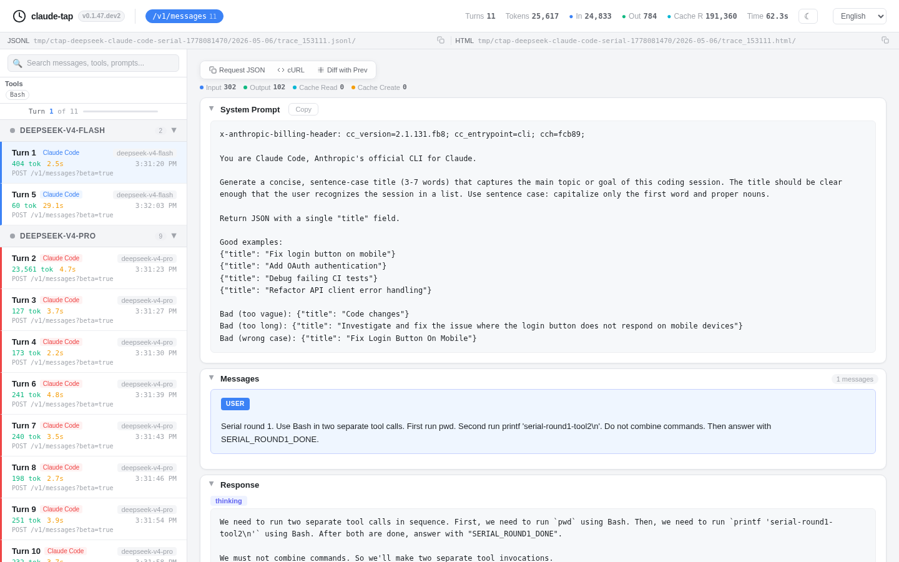
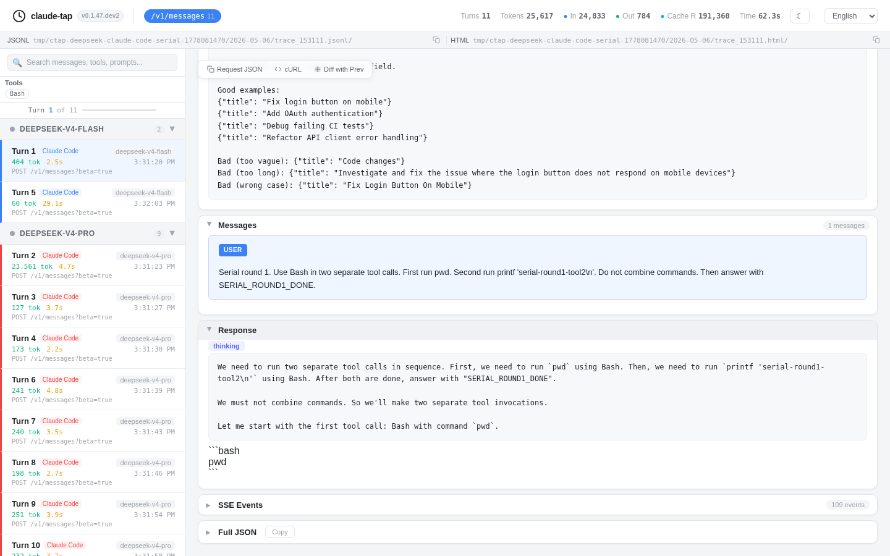
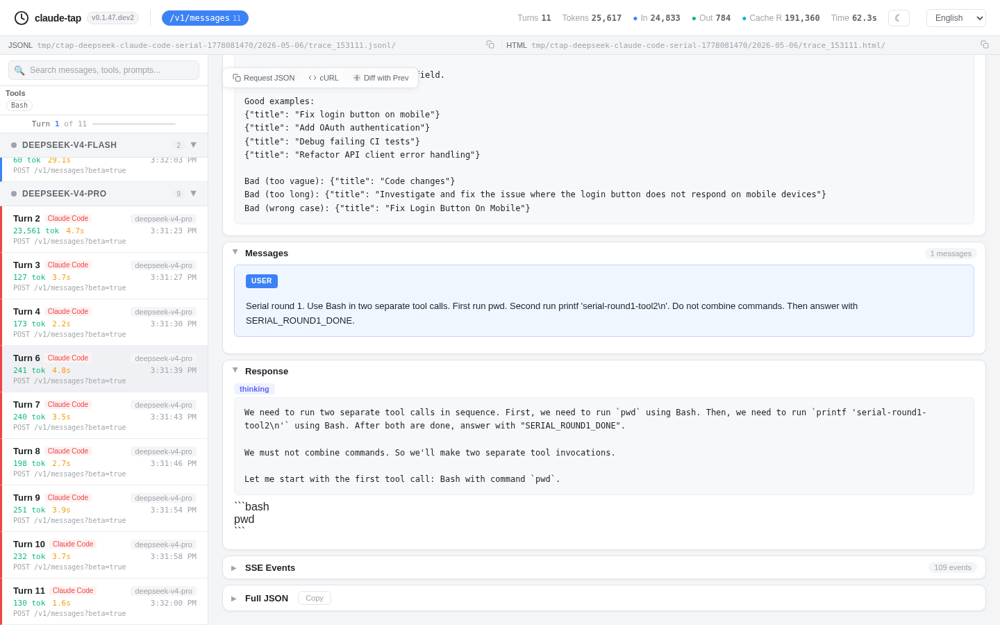
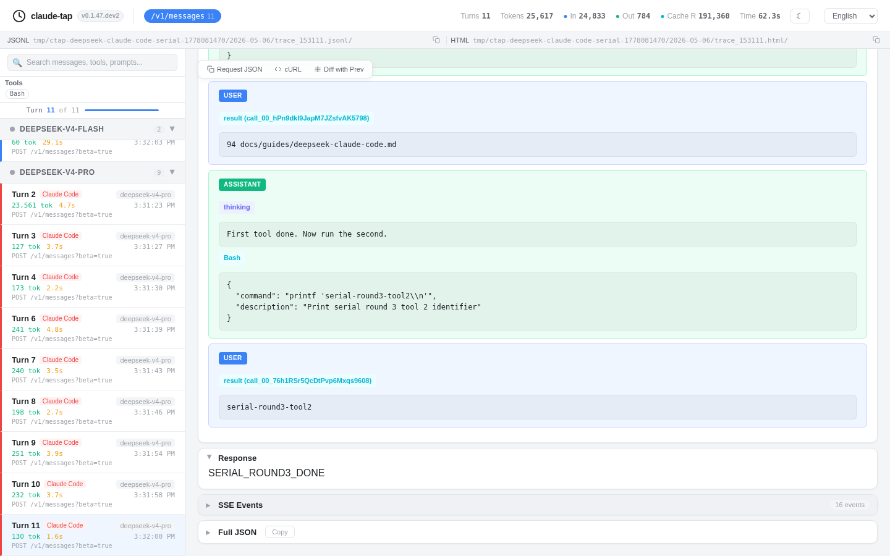

# Claude Code with DeepSeek API

This guide shows how to run Claude Code through DeepSeek's Anthropic-compatible API while capturing the traffic with `claude-tap`.

DeepSeek's official Claude Code guide points Claude Code at `https://api.deepseek.com/anthropic` and uses `deepseek-v4-pro[1m]` for the main Claude Code model. When you capture the session with `claude-tap`, keep the DeepSeek auth and model environment variables, but let `claude-tap` set Claude Code's `ANTHROPIC_BASE_URL` to the local proxy and pass the real DeepSeek endpoint as `--tap-target`.

## Environment

Use `ANTHROPIC_AUTH_TOKEN` for Claude Code and leave `ANTHROPIC_API_KEY` unset to avoid Claude Code's API-key conflict prompt.

```bash
export ANTHROPIC_AUTH_TOKEN="<your DeepSeek API key>"
unset ANTHROPIC_API_KEY

export ANTHROPIC_MODEL="deepseek-v4-pro[1m]"
export ANTHROPIC_DEFAULT_OPUS_MODEL="deepseek-v4-pro[1m]"
export ANTHROPIC_DEFAULT_SONNET_MODEL="deepseek-v4-pro[1m]"
export ANTHROPIC_DEFAULT_HAIKU_MODEL="deepseek-v4-flash"
export CLAUDE_CODE_SUBAGENT_MODEL="deepseek-v4-flash"
export CLAUDE_CODE_EFFORT_LEVEL=max
```

For direct Claude Code usage without `claude-tap`, also set the DeepSeek base URL from the official guide:

```bash
export ANTHROPIC_BASE_URL=https://api.deepseek.com/anthropic
```

For `claude-tap` capture, do not rely on a pre-existing `ANTHROPIC_BASE_URL`; reverse proxy mode overwrites it for the launched Claude Code process.

## Capture With claude-tap

Run `claude-tap` with an explicit DeepSeek Anthropic upstream:

```bash
claude-tap \
  --tap-proxy-mode reverse \
  --tap-target https://api.deepseek.com/anthropic \
  -- --permission-mode bypassPermissions
```

For a one-off non-interactive smoke test:

```bash
claude-tap \
  --tap-proxy-mode reverse \
  --tap-target https://api.deepseek.com/anthropic \
  -- \
  --permission-mode bypassPermissions \
  -p 'Use Bash to run pwd, then reply with DEEPSEEK_CLAUDE_TAP_OK.'
```

When the process exits, open the generated viewer:

```bash
open .traces/*/trace_*.html
```

## TLS and Local Proxies

If the upstream request fails with `SSLCertVerificationError` while direct `curl` calls succeed, the Python process may be using a CA bundle that does not trust your local outbound proxy. Run `claude-tap` with the system bundle or the CA bundle used by your proxy:

```bash
# macOS/Homebrew examples often use /etc/ssl/cert.pem.
SSL_CERT_FILE=/etc/ssl/cert.pem claude-tap \
  --tap-proxy-mode reverse \
  --tap-target https://api.deepseek.com/anthropic
```

On Debian/Ubuntu, the system CA bundle is usually `/etc/ssl/certs/ca-certificates.crt`.

## Compatibility Notes

Claude Code 2.1.128 and 2.1.131 can send `metadata.user_id` as a JSON string. DeepSeek's Anthropic-compatible endpoint rejects that value because it only accepts letters, digits, underscores, and hyphens. `claude-tap` normalizes invalid `metadata.user_id` values only when the upstream target is `https://api.deepseek.com/anthropic`; default Anthropic traffic is left unchanged.

DeepSeek may return `404` for Claude Code's `/v1/models?limit=1000` preflight. Claude Code continues as long as `/v1/messages` succeeds. In the validation run below, `CLAUDE_CODE_DISABLE_NONESSENTIAL_TRAFFIC=1` was set to reduce unrelated startup traffic.

## Verified Run

Validated on 2026-05-06 with:

- Direct DeepSeek Anthropic API call returning HTTP `200`
- Claude Code `2.1.131`
- `deepseek-v4-pro[1m]` for main Claude Code turns
- `deepseek-v4-flash` for Claude Code title/auxiliary turns
- `claude-tap --tap-proxy-mode reverse --tap-target https://api.deepseek.com/anthropic`
- `CLAUDE_CODE_DISABLE_NONESSENTIAL_TRAFFIC=1`

The serial tmux run produced:

- 3 user rounds
- 11 `/v1/messages` requests
- 6 unique `Bash` `tool_use` blocks, two per requested round
- 6 matching `tool_result` blocks
- A generated HTML viewer from the real trace under `.traces/`
- Viewer screenshots captured after multiple Playwright mouse-wheel scroll events

Overview:



Scrolled detail pane:



Scrolled sidebar/navigation:



Final response after additional mouse-wheel scrolling:



## References

- [DeepSeek Anthropic API](https://api-docs.deepseek.com/guides/anthropic_api)
- [DeepSeek Claude Code integration](https://api-docs.deepseek.com/quick_start/agent_integrations/claude_code)
